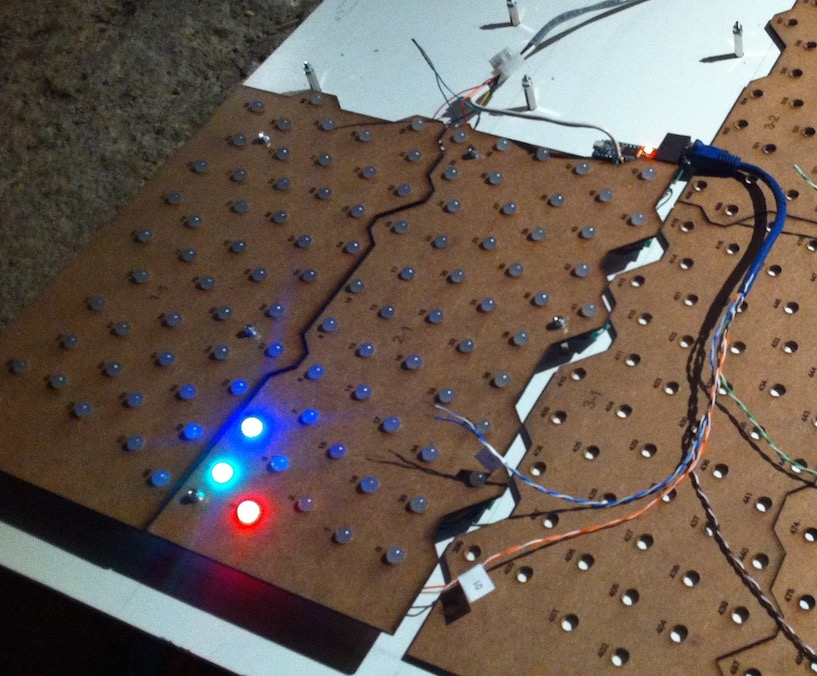
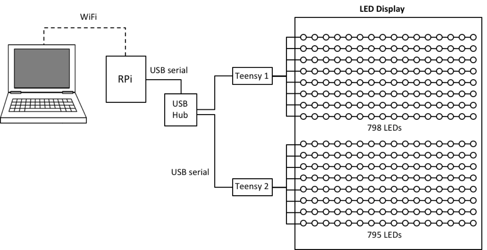

# Irregular Led Display Project

Driver code and other documentation for an irregular 1593-LED light display screen.

**Construction of Irregular LED Display**

The 1593 LEDs are arranged in an irregular pattern on a 4x4 foot display (1.2 x 1.2 metres).  The LEDs are mounted on pieces of hardboard cut with a lazer cutter from pattern files produced by a random spacing algorithm.

## Design documents
* [dwg.150406_final.pdf](https://github.com/billtubbs/led-display-project/blob/master/dwg.150406_final.pdf) - Arrangement drawing of the LED mounting plates

## Control system design

**Control System Architecture**

The LEDs are driven by two [Teensy 3.1 microcontrollers](https://www.pjrc.com/teensy/teensy31.html) mounted on OctoWS2811 adaptor boards communicating with 16 led strips (8 strips connected to each Teensy).

Each strip contains around 98 to 100 5-volt [WS2811 RGB LEDs](https://www.aliexpress.com/item/DC5V-WS2811-pixel-node-50node-a-string-non-waterproof-SIZE-13mm-13mm/1624010105.html) 

The Teensy driver code uses the OctoWS2811 LED Library provided by Paul Stoffregen:
* https://www.pjrc.com/teensy/td_libs_OctoWS2811.html

The Teensy microcontrollers are connected to a [Raspberry Pi Zero](https://www.raspberrypi.org/products/raspberry-pi-zero/) via USB (serial).

## Driver code

* [serial_read_1593.ino](https://github.com/billtubbs/led-display-project/blob/master/serial_read_1593.ino) - Arduino code for Teensies
* [arraydata.h](https://github.com/billtubbs/led-display-project/blob/master/arraydata.h) - Arduino data file containing LED co-ordinates, nearest neighbours etc.

## Completed project

For a photo of the completed display and more information on the Raspberry Pi code and some of the display projects, see this separate repository:
* https://github.com/billtubbs/display1593/

## Acknowledgements

Thanks to:
* [Crashbang Labs Regina](https://crashbanglabs.net) for providing the means and motivation to make this project happen.
* [Paul Stoffregen](https://github.com/PaulStoffregen) for Teensy development and helpful advice.

